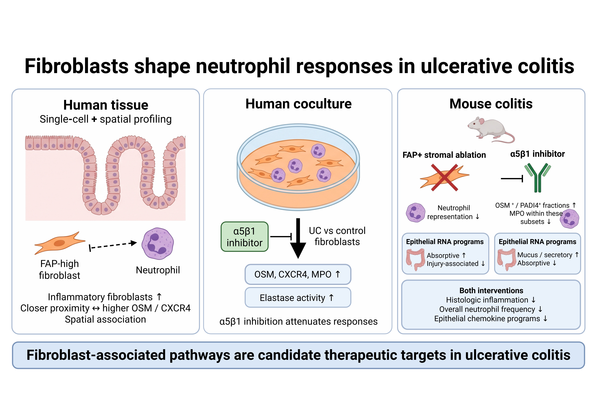

# Graphical abstract

Author-supplied BioRender artwork, copied without alteration from the final manuscript package (6000 × 4200 pixels). It summarizes human tissue and coculture observations, stromal interventions in DSS colitis, and neutrophil and epithelial responses.

Attribution supplied by the corresponding author:

Created in BioRender. Gubatan, J. (2026) https://BioRender.com/wml1goc

The corresponding author confirmed possession of the open-access publication license on September 21, 2026. This completed graphic is included under that author-confirmed license, with the supplied attribution retained. Repeated public URL checks on September 21, 2026 returned HTTP 404. The author-supplied credit is retained exactly; public accessibility of the citation page remains unresolved.

BioRender content is subject to its applicable publication license and attribution requirements; see the [official guidance](https://help.biorender.com/hc/en-gb/articles/28577290921117-Publishing-BioRender-figures-in-a-journal-What-you-need-to-know). The editable PowerPoint and isolated graphic components are not distributed in this repository.
